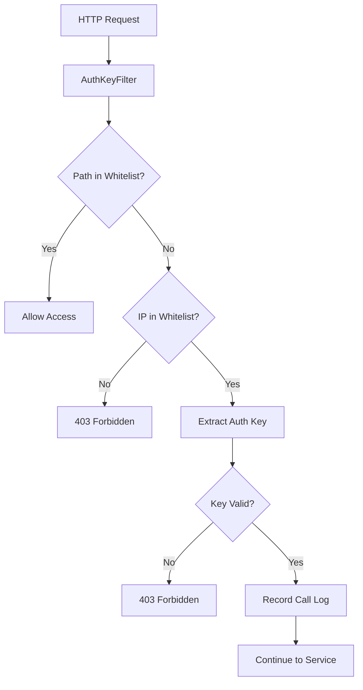
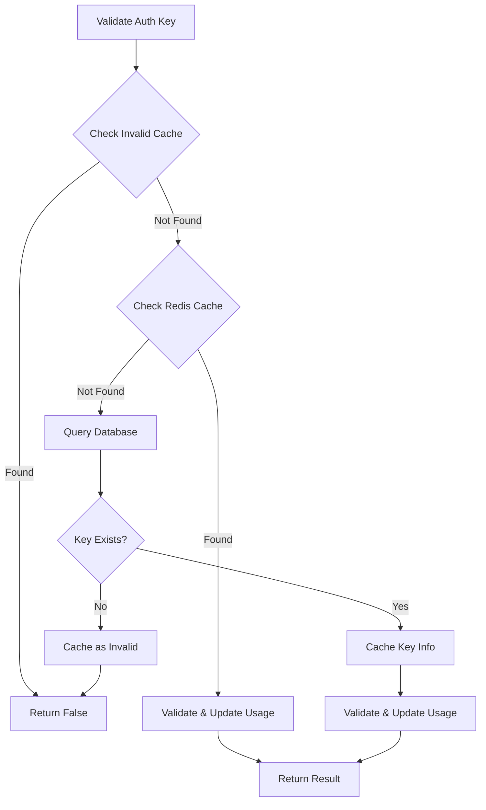

# Auth模块 - MCP网关认证模块

🔐 为MCP网关提供统一的身份认证、权限控制和调用记录功能

## 模块概述

Auth模块是MCP Gateway的核心安全组件，负责处理所有进入网关的请求认证。基于Spring WebFlux实现的高性能认证过滤器，支持多种认证方式和灵活的访问控制策略。

## 核心功能

- 🔑 **多种认证方式**: 支持静态密钥认证和数据库动态密钥认证
- 🛡️ **访问控制**: 路径白名单、IP白名单、密钥有效性验证
- 📊 **调用记录**: 异步记录每次API调用，支持审计和统计
- ⚡ **高性能缓存**: Redis缓存认证信息，减少数据库压力
- 🔄 **异步处理**: 非阻塞式认证流程，支持高并发场景

## 技术架构

```
┌─────────────────────────────────────────────────────────────┐
│                    WebFlux Request Pipeline                 │
└─────────────────────┬───────────────────────────────────────┘
                      │
                      ▼
┌─────────────────────────────────────────────────────────────┐
│                  AuthKeyFilter                              │
│                (Order: HIGHEST_PRECEDENCE)                 │
└─────────────────────┬───────────────────────────────────────┘
                      │
                      ▼
┌─────────────────────────────────────────────────────────────┐
│                  AuthService                                │
│  ┌─────────────┐  ┌─────────────┐  ┌─────────────────────┐  │
│  │   Whitelist │  │  IP Filter  │  │    Key Validation   │  │
│  │   Check     │  │   Check     │  │                     │  │
│  └─────────────┘  └─────────────┘  └─────────────────────┘  │
└─────────────────────┬───────────────────────────────────────┘
                      │
                      ▼
┌─────────────────────────────────────────────────────────────┐
│                 Redis Cache + Database                     │
│  ┌─────────────┐  ┌─────────────┐  ┌─────────────────────┐  │
│  │  Auth Key   │  │ Invalid Key │  │   Call Log          │  │
│  │   Cache     │  │   Cache     │  │   Recording         │  │
│  └─────────────┘  └─────────────┘  └─────────────────────┘  │
└─────────────────────────────────────────────────────────────┘
```

## 认证流程

### 1. 请求认证流程



### 2. 密钥验证流程



## 配置说明

### application.yml配置

```yaml
jdt:
  mcp:
    auth:
      # 是否启用认证
      enabled: true
      
      # 认证类型: db(数据库) / staticKey(静态密钥)
      authType: db
      
      # 静态认证密钥列表（当authType为staticKey时使用）
      validKeys:
        - "admin-key-jdt"
        - "test-key-123"
      
      # 路径白名单，这些路径不需要认证
      whitelist:
        - "/health"
        - "/actuator/**"
        - "/mcp/health"
      
      # 认证失败时的响应消息
      unauthorizedMessage: "Authentication required"
      
      # 是否启用IP白名单
      enableIpWhitelist: false
      
      # IP白名单（当enableIpWhitelist为true时使用）
      allowedIps:
        - "127.0.0.1"
        - "::1"
        - "192.168.1.0/24"
```

## 使用方式

### 1. 密钥认证方式

客户端可以通过以下三种方式提供认证密钥：

#### 方式一：查询参数
```bash
curl "http://localhost:8080/mcp/weather-service/api?key=your-auth-key"
```

#### 方式二：Authorization Header
```bash
curl -H "Authorization: Bearer your-auth-key" \
     http://localhost:8080/mcp/weather-service/api
```

#### 方式三：X-Auth-Key Header
```bash
curl -H "X-Auth-Key: your-auth-key" \
     http://localhost:8080/mcp/weather-service/api
```

### 2. 认证上下文使用

在下游服务中获取认证信息：

```java
@RestController
public class MyController {
    
    @Autowired
    private AuthContextHelper authContextHelper;
    
    @GetMapping("/api/user-info")
    public Mono<String> getUserInfo(ServerWebExchange exchange) {
        AuthContextHelper.AuthInfo authInfo = authContextHelper.getAuthInfoFromExchange(exchange);
        String authKey = authInfo.authKey();
        String connectionId = authInfo.connectionId();
        
        return Mono.just("User authenticated with key: " + maskKey(authKey));
    }
}
```
## 数据库设计

### auth_keys表结构

```sql
CREATE TABLE auth_keys (
    id BIGINT PRIMARY KEY AUTO_INCREMENT,
    key_hash VARCHAR(64) NOT NULL UNIQUE COMMENT '认证密钥哈希',
    user_id VARCHAR(32) NOT NULL COMMENT '用户ID',
    service_id VARCHAR(64) NOT NULL COMMENT '服务ID',
    expires_at DATETIME NULL COMMENT '过期时间，NULL表示永不过期',
    is_active BOOLEAN DEFAULT TRUE COMMENT '是否激活',
    created_at DATETIME DEFAULT CURRENT_TIMESTAMP,
    updated_at DATETIME DEFAULT CURRENT_TIMESTAMP ON UPDATE CURRENT_TIMESTAMP,
    last_used_at DATETIME NULL COMMENT '最后使用时间',
    remarks TEXT COMMENT '备注信息',
    
    INDEX idx_key_hash (key_hash),
    INDEX idx_user_id (user_id),
    INDEX idx_service_id (service_id),
    INDEX idx_active_expires (is_active, expires_at)
);
```

### auth_call_logs表结构

```sql
CREATE TABLE auth_call_logs (
    id BIGINT PRIMARY KEY AUTO_INCREMENT,
    user_id VARCHAR(32) NOT NULL,
    service_id VARCHAR(64) NOT NULL,
    auth_key_id BIGINT NOT NULL,
    request_path VARCHAR(512) NOT NULL,
    request_method VARCHAR(10) NOT NULL,
    client_ip VARCHAR(45) NOT NULL,
    response_code INT NOT NULL,
    created_at DATETIME DEFAULT CURRENT_TIMESTAMP,
    
    INDEX idx_user_id (user_id),
    INDEX idx_service_id (service_id),
    INDEX idx_auth_key_id (auth_key_id),
    INDEX idx_created_at (created_at)
);
```

## Redis缓存策略

### 1. 认证密钥缓存

```
Key: auth:key:{keyHash}
Value: JSON格式的AuthKeyEntity
TTL: 1小时
```

### 2. 无效密钥缓存

```
Key: auth:invalid:{keyHash}
Value: "1"
TTL: 5分钟
```

### 3. 最后使用时间缓存

```
Key: auth:lastused:{keyHash}
Value: 时间戳
TTL: 24小时
```

## 性能优化

### 1. 异步日志记录

使用Reactor Sinks实现异步日志记录，避免阻塞主请求流程：

### 2. 缓存优化策略
- **缓存穿透保护**: 缓存无效密钥，防止重复数据库查询
- **缓存预热**: 应用启动时预加载热点密钥
- **缓存更新**: 异步更新最后使用时间，减少阻塞

### 3. 数据库优化

- **连接池配置**: 合理配置HikariCP参数
- **索引优化**: 为常用查询字段建立索引
- **批量操作**: 使用批量插入记录调用日志

## 错误处理

### 1. 认证失败响应

```json
{
  "error": "鉴权失败，请在智能研发门户申请key",
  "code": 403,
  "timestamp": "2024-01-15T10:30:00"
}
```

### 2. 系统错误响应

```json
{
  "error": "鉴权服务失败",
  "code": 403,
  "timestamp": "2024-01-15T10:30:00"
}
```

## 监控和指标

### 1. 关键指标

- **认证成功率**: 成功认证请求 / 总请求数
- **认证响应时间**: P50, P90, P99响应时间
- **缓存命中率**: Redis缓存命中 / 总查询次数
- **无效密钥比例**: 无效密钥请求 / 总请求数

### 2. 监控端点

```bash
# 认证服务健康检查
curl http://localhost:8080/actuator/health
```

## 安全建议

### 1. 密钥安全

- **密钥复杂度**: 使用强随机密钥生成器
- **密钥轮换**: 定期更新密钥
- **密钥存储**: 数据库中密钥经过哈希处理

### 2. 访问控制

- **最小权限原则**: 密钥只授权必要的服务
- **IP白名单**: 在高安全要求环境启用IP限制
- **路径控制**: 合理配置白名单路径

### 3. 审计日志

- **完整记录**: 记录所有认证尝试
- **日志保护**: 防止日志被篡改
- **定期清理**: 定期归档历史日志

## 故障排查

### 1. 常见问题

#### 认证一直失败
```bash
# 检查密钥是否存在
SELECT * FROM auth_keys WHERE key_hash = 'your-key-hash';

# 检查密钥是否过期
SELECT * FROM auth_keys WHERE key_hash = 'your-key-hash' AND 
  (expires_at IS NULL OR expires_at > NOW()) AND is_active = TRUE;

# 检查Redis缓存
redis-cli GET auth:key:your-key-hash
```

#### 缓存问题
```bash
# 清空认证相关缓存
redis-cli DEL auth:key:*
redis-cli DEL auth:invalid:*

# 检查缓存连接
redis-cli PING
```

#### 日志记录异常
```bash
# 检查异步日志处理器状态
grep "Async log processor" logs/gateway.log

# 检查数据库连接
grep "Error recording auth call" logs/gateway.log
```

### 2. 调试模式

启用详细日志：

```yaml
logging:
  level:
    org.jdt.mcp.gateway.auth: DEBUG
    org.springframework.data.redis: DEBUG
```

## 部署注意事项

### 1. 环境配置

```yaml
# 生产环境建议配置
jdt:
  mcp:
    auth:
      enabled: true
      authType: db
      enableIpWhitelist: true  # 生产环境建议启用
      allowedIps:
        - "10.0.0.0/8"
        - "172.16.0.0/12"
        - "192.168.0.0/16"
```

### 2. 数据库配置

```yaml
spring:
  datasource:
    hikari:
      maximum-pool-size: 20
      minimum-idle: 5
      connection-timeout: 20000
      validation-timeout: 3000
```

### 3. Redis配置

```yaml
spring:
  data:
    redis:
      timeout: 2000ms
      lettuce:
        pool:
          max-active: 8
          max-wait: -1ms
          max-idle: 8
          min-idle: 0
```

## 扩展开发

### 1. 自定义认证方式

实现`AuthService`接口：

```java
@Service
public class CustomAuthServiceImpl implements AuthService {
    
    @Override
    public Mono<Boolean> validateAuthKey(String authKey) {
        // 实现自定义认证逻辑
        return Mono.just(true);
    }
    
    // 实现其他必要方法
}
```

### 2. 自定义认证过滤器

扩展认证过滤器：

```java
@Component
@Order(Ordered.HIGHEST_PRECEDENCE + 1)
public class CustomAuthFilter implements WebFilter {
    
    @Override
    public Mono<Void> filter(ServerWebExchange exchange, WebFilterChain chain) {
        // 实现自定义认证逻辑
        return chain.filter(exchange);
    }
}
```

## API参考

### AuthService接口

```java
public interface AuthService {
    boolean isWhitelistedPath(String path);
    boolean isAllowedIp(String clientIp);
    Mono<Boolean> validateAuthKey(String authKey);
    Mono<Boolean> integrationValidate(String path, String ip, String authKey);
}
```

### AuthContextHelper工具类

```java
public class AuthContextHelper {
    public AuthInfo getAuthInfoFromExchange(ServerWebExchange exchange);
    public AuthInfo getAuthInfoSync();
    
    public record AuthInfo(String authKey, String connectionId) {}
}
```

---

更多信息请参考[主工程README](../README.md)和相关API文档。