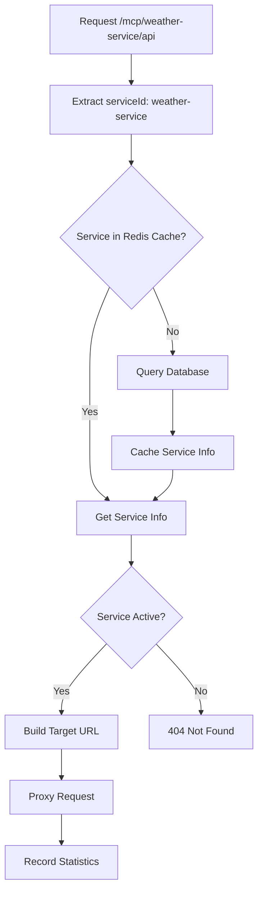

# Proxy模块 - MCP网关代理模块

🚀 高性能、响应式的MCP服务代理模块，提供协议转换、请求路由和统计监控功能

## 模块概述

Proxy模块是MCP Gateway的核心代理组件，基于Spring WebFlux构建的高性能响应式代理服务。负责将客户端的HTTP请求转换并路由到后端MCP服务，同时提供完整的监控统计和故障处理能力。

## 核心功能

- 🌐 **协议代理**: HTTP到MCP协议的透明代理转换
- 🎯 **智能路由**: 基于路径的服务发现和动态路由
- 📊 **实时统计**: 服务调用次数、响应时间、成功率统计
- ⚡ **高性能**: 基于WebFlux的非阻塞式处理
- 🔄 **容错处理**: 超时控制、重试机制、错误降级
- 💾 **缓存优化**: Redis缓存服务信息和统计数据

## 技术架构

```
┌─────────────────────────────────────────────────────────────┐
│                    Client Request                           │
│                  (HTTP/HTTPS)                               │
└─────────────────────┬───────────────────────────────────────┘
                      │
                      ▼
┌─────────────────────────────────────────────────────────────┐
│               MCPProxyController                            │
│              (/mcp/{serviceId}/**)                          │
└─────────────────────┬───────────────────────────────────────┘
                      │
                      ▼
┌─────────────────────────────────────────────────────────────┐
│                McpProxyHandler                              │
│  ┌─────────────┐  ┌─────────────┐  ┌─────────────────────┐  │
│  │   Service   │  │   Request   │  │     Response        │  │
│  │  Discovery  │  │   Proxy     │  │    Handling         │  │
│  └─────────────┘  └─────────────┘  └─────────────────────┘  │
└─────────────────────┬───────────────────────────────────────┘
                      │
                      ▼
┌─────────────────────────────────────────────────────────────┐
│                Backend MCP Services                         │
│  ┌─────────────┐  ┌─────────────┐  ┌─────────────────────┐  │
│  │   Weather   │  │     HR      │  │       File          │  │
│  │  Service    │  │   Service   │  │     Service         │  │
│  │  :8081      │  │   :8082     │  │     :8083           │  │
│  └─────────────┘  └─────────────┘  └─────────────────────┘  │
└─────────────────────────────────────────────────────────────┘
```

## 代理路径规则

### 路径映射规则

```
客户端请求: http://gateway:8080/mcp/{serviceId}/{servicePath}
后端服务: http://service-endpoint/{servicePath}

示例:
客户端: http://localhost:8080/mcp/weather-service/api/current?city=Beijing
后端: http://localhost:8081/api/current?city=Beijing
```

### 服务发现流程



## 配置说明

### application.yml配置

```yaml
server:
  port: 8080

jdt:
  mcp:
    proxy:
      # 代理超时时间
      timeout: 300s
      
      # 最大内存大小（用于处理请求体）
      maxInMemorySize: 262144  # 256KB
      
      # 连接超时
      connectTimeout: 5s
      
      # 读取超时  
      readTimeout: 30s
      
      # 是否启用统计
      enableStatistics: true
      
      # 是否启用请求日志
      enableRequestLogging: true

# WebClient配置
spring:
  webflux:
    multipart:
      max-in-memory-size: 256KB
```

## API接口

### 1. 代理接口

#### 🚀 MCP服务代理

**接口地址**: `/mcp/{serviceId}/**`

**支持方法**: GET, POST, PUT, DELETE, PATCH, OPTIONS

**请求示例**:
```bash
# GET请求
curl "http://localhost:8080/mcp/weather-service/api/current?city=Beijing&key=your-auth-key"

# POST请求
curl -X POST http://localhost:8080/mcp/hr-service/api/search \
  -H "Content-Type: application/json" \
  -H "X-Auth-Key: your-auth-key" \
  -d '{"name": "张三", "department": "技术部"}'

# 文件上传
curl -X POST http://localhost:8080/mcp/file-service/upload \
  -H "Authorization: Bearer your-auth-key" \
  -F "file=@document.pdf"
```

### 2. 统计接口

#### 实时统计信息

**接口地址**: `GET /mcp/stats/{serviceId}/realtime`

**请求示例**:
```bash
curl http://localhost:8080/mcp/stats/weather-service/realtime
```

**响应示例**:
```json
{
  "serviceId": "weather-service",
  "source": "realtime",
  "totalCalls": 1250,
  "successCalls": 1198,
  "failedCalls": 52,
  "successRate": 95.84,
  "averageResponseTime": 145,
  "maxResponseTime": 2300,
  "uniqueUsers": 25,
  "lastCallTime": "2024-01-15T14:30:25"
}
```

#### 数据库统计信息

**接口地址**: `GET /mcp/stats/{serviceId}`

**请求示例**:
```bash
curl http://localhost:8080/mcp/stats/weather-service
```

### 3. 服务管理接口

#### 获取所有服务状态

**接口地址**: `GET /mcp/services`

**响应示例**:
```json
{
  "services": [
    {
      "id": 1,
      "serviceId": "weather-service",
      "name": "天气查询服务",
      "endpoint": "http://localhost:8081",
      "status": "ACTIVE",
      "maxQps": 1000,
      "createdAt": "2024-01-15T10:00:00"
    }
  ],
  "count": 1
}
```

#### 刷新服务缓存

**接口地址**: `POST /mcp/refresh`

**请求示例**:
```bash
curl -X POST http://localhost:8080/mcp/refresh
```

#### 刷新统计数据

**接口地址**: `POST /mcp/stats/flush`

**请求示例**:
```bash
curl -X POST http://localhost:8080/mcp/stats/flush
```

#### 清理统计缓存

**接口地址**: `DELETE /mcp/stats/cache`

**请求示例**:
```bash
curl -X DELETE http://localhost:8080/mcp/stats/cache
```

### 4. 健康检查

**接口地址**: `GET /mcp/health`

**响应示例**:
```json
{
  "status": "UP",
  "service": "MCP Gateway Proxy",
  "timestamp": "2024-01-15T14:30:25.123Z"
}
```

## 服务发现

### MCPDiscoveryService

负责服务发现和缓存管理：

```java
// 获取服务信息
Mono<MCPServiceEntity> service = mcpDiscoveryService.getService("weather-service");

// 获取所有活跃服务
Flux<MCPServiceEntity> services = mcpDiscoveryService.getAllActiveServices();

// 刷新服务缓存
mcpDiscoveryService.refreshServiceCache();
```

### 缓存策略

#### 服务信息缓存
```
Key: mcp:service:{serviceId}
Value: JSON格式的MCPServiceEntity  
TTL: 30分钟
```

#### 活跃服务列表缓存
```
Key: mcp:services:active
Value: 活跃服务ID列表
TTL: 10分钟
```

## 统计监控

### StatisticsService

提供完整的统计监控功能：

```java
// 记录请求统计
statisticsService.recordRequest(exchange, serviceId, statusCode, responseTime);

// 获取实时统计
Mono<ServiceStats> realtimeStats = statisticsService.getRealtimeServiceStats(serviceId);

// 获取数据库统计  
Mono<ServiceStats> dbStats = statisticsService.getServiceStats(serviceId);
```

### Redis统计数据结构

#### 服务统计
```
Key: stats:service:{serviceId}:{date}
Fields: 
  - total_calls: 总调用次数
  - success_calls: 成功调用次数
  - failed_calls: 失败调用次数
  - total_response_time: 总响应时间
  - max_response_time: 最大响应时间
```

#### 用户统计
```
Key: stats:users:{serviceId}:{date}
Value: Set of unique user IDs
```

### 定时任务

StatisticsScheduler负责定期将Redis统计数据刷新到MySQL：

## 数据库设计

### service_statistics表结构

```sql
CREATE TABLE service_statistics (
    id BIGINT PRIMARY KEY AUTO_INCREMENT,
    service_id VARCHAR(64) NOT NULL COMMENT '服务ID',
    date_key DATE NOT NULL COMMENT '统计日期',
    total_calls INT DEFAULT 0 COMMENT '总调用次数',
    success_calls INT DEFAULT 0 COMMENT '成功调用次数', 
    failed_calls INT DEFAULT 0 COMMENT '失败调用次数',
    avg_response_time_ms INT DEFAULT 0 COMMENT '平均响应时间(毫秒)',
    max_response_time_ms INT DEFAULT 0 COMMENT '最大响应时间(毫秒)',
    unique_users INT DEFAULT 0 COMMENT '独立用户数',
    created_at DATETIME DEFAULT CURRENT_TIMESTAMP,
    updated_at DATETIME DEFAULT CURRENT_TIMESTAMP ON UPDATE CURRENT_TIMESTAMP,
    
    UNIQUE KEY uk_service_date (service_id, date_key),
    INDEX idx_service_id (service_id),
    INDEX idx_date_key (date_key)
);
```

### mcp_services表结构

```sql
CREATE TABLE mcp_services (
    id BIGINT PRIMARY KEY AUTO_INCREMENT,
    service_id VARCHAR(64) NOT NULL UNIQUE COMMENT '服务唯一标识',
    name VARCHAR(128) NOT NULL COMMENT '服务名称',
    description TEXT COMMENT '服务描述',
    endpoint VARCHAR(512) NOT NULL COMMENT '服务端点URL',
    status ENUM('ACTIVE', 'INACTIVE', 'MAINTENANCE') DEFAULT 'ACTIVE',
    max_qps INT DEFAULT 100 COMMENT '最大QPS限制',
    health_check_url VARCHAR(512) COMMENT '健康检查URL',
    documentation TEXT COMMENT '服务文档',
    created_at DATETIME DEFAULT CURRENT_TIMESTAMP,
    updated_at DATETIME DEFAULT CURRENT_TIMESTAMP ON UPDATE CURRENT_TIMESTAMP,
    
    INDEX idx_service_id (service_id),
    INDEX idx_status (status)
);
```

## 性能优化

### 1. 连接池配置

```java
@Bean
public WebClient webClient(ProxyConfiguration proxyConfig) {
    HttpClient httpClient = HttpClient.create()
        .responseTimeout(proxyConfig.getTimeout())
        .option(ChannelOption.CONNECT_TIMEOUT_MILLIS, 5000)
        .option(ChannelOption.SO_KEEPALIVE, true)
        .option(ChannelOption.TCP_NODELAY, true);
        
    return WebClient.builder()
        .clientConnector(new ReactorClientHttpConnector(httpClient))
        .codecs(configurer -> 
            configurer.defaultCodecs()
                .maxInMemorySize((int) proxyConfig.getMaxInMemorySize())
        )
        .build();
}
```

### 2. 内存管理

```yaml
# 限制请求体大小，防止内存溢出
jdt:
  mcp:
    proxy:
      maxInMemorySize: 262144  # 256KB

# WebFlux配置
spring:
  webflux:
    multipart:
      max-in-memory-size: 256KB
      max-disk-usage-per-part: 10MB
```

### 3. 异步处理优化

```java
// 异步记录统计，不阻塞主请求流程
statisticsService.recordRequest(exchange, serviceId, statusCode, responseTime)
    .subscribeOn(Schedulers.boundedElastic())
    .subscribe();

// 异步更新缓存
mcpDiscoveryService.updateServiceCache(serviceId)
    .subscribeOn(Schedulers.boundedElastic())
    .subscribe();
```

## 错误处理

### 1. 服务不存在

```json
{
  "error": "Service not found: invalid-service",
  "code": 404,
  "timestamp": "2024-01-15T14:30:25.123Z"
}
```

### 2. 代理超时

```json
{
  "error": "Proxy error: ReadTimeoutException",
  "code": 500,
  "timestamp": "2024-01-15T14:30:25.123Z"
}
```

### 3. 后端服务异常

```json
{
  "error": "Backend service error",
  "code": 502,
  "timestamp": "2024-01-15T14:30:25.123Z"
}
```

## 监控和告警

### 1. 关键指标

- **代理成功率**: 成功代理请求 / 总请求数
- **代理响应时间**: P50, P90, P99响应时间分布
- **后端服务可用性**: 各服务的健康状态
- **并发连接数**: 当前活跃连接数

### 2. Actuator端点

```bash
# 健康检查
curl http://localhost:8080/actuator/health

# 指标监控
curl http://localhost:8080/actuator/metrics
curl http://localhost:8080/actuator/metrics/http.server.requests

# 应用信息
curl http://localhost:8080/actuator/info
```

### 3. 自定义监控端点

```bash
# 实时统计监控
curl http://localhost:8080/mcp/stats/{serviceId}/realtime

# 服务状态监控
curl http://localhost:8080/mcp/services

# 缓存状态监控  
curl http://localhost:8080/mcp/cache/status
```

## 容错和重试

### 1. 重试策略

```java
.retryWhen(Retry.backoff(2, Duration.ofMillis(100))
    .filter(throwable -> !(throwable instanceof IllegalArgumentException)))
```

### 2. 超时控制

```java
HttpClient httpClient = HttpClient.create()
    .responseTimeout(proxyConfig.getTimeout())  // 响应超时
    .option(ChannelOption.CONNECT_TIMEOUT_MILLIS, 5000);  // 连接超时
```

### 3. 熔断降级

```java
// 后端服务异常时返回降级响应
.onErrorResume(throwable -> {
    log.error("Backend service error: {}", throwable.getMessage());
    return handleError(response, HttpStatus.BAD_GATEWAY, "Backend service unavailable");
});
```

## 部署配置

### 1. 生产环境配置

```yaml
server:
  port: 8080
  netty:
    connection-timeout: 20s
    h2c-max-content-length: 0
    max-connection-age: 60s

jdt:
  mcp:
    proxy:
      timeout: 60s  # 生产环境建议较短超时
      connectTimeout: 3s
      readTimeout: 30s
      maxInMemorySize: 1048576  # 1MB
      enableStatistics: true
      enableRequestLogging: false  # 生产环境可关闭详细日志

logging:
  level:
    org.jdt.mcp.gateway.proxy: INFO
    reactor.netty: WARN
```

### 2. JVM参数调优

```bash
java -jar proxy-0.0.1-SNAPSHOT.jar \
  -Xms1g -Xmx2g \
  -XX:+UseG1GC \
  -XX:MaxGCPauseMillis=100 \
  -XX:+UseStringDeduplication \
  -Dreactor.netty.ioWorkerCount=4 \
  -Dreactor.netty.ioSelectCount=2
```

### 3. Docker部署

```dockerfile
FROM openjdk:17-jdk-alpine

# 安装必要组件
RUN apk add --no-cache curl

# 创建应用用户
RUN addgroup -g 1001 -S appgroup && \
    adduser -u 1001 -S appuser -G appgroup

# 复制应用文件
COPY target/proxy-0.0.1-SNAPSHOT.jar /app/app.jar

# 设置工作目录和权限
WORKDIR /app
RUN chown -R appuser:appgroup /app
USER appuser

# 健康检查
HEALTHCHECK --interval=30s --timeout=10s --start-period=60s \
  CMD curl -f http://localhost:8080/mcp/health || exit 1

# 启动应用
EXPOSE 8080
ENTRYPOINT ["java", "-jar", "app.jar"]
```

## 故障排查

### 1. 常见问题

#### 代理请求超时
```bash
# 检查后端服务状态
curl http://backend-service:8081/health

# 检查网络连通性
telnet backend-service 8081

# 调整超时配置
jdt.mcp.proxy.timeout=60s
```

#### 服务发现失败
```bash
# 检查数据库连接
SELECT * FROM mcp_services WHERE service_id = 'weather-service';

# 检查Redis缓存
redis-cli GET mcp:service:weather-service

# 手动刷新服务缓存
curl -X POST http://localhost:8080/mcp/refresh
```

#### 统计数据异常
```bash
# 检查Redis连接
redis-cli PING

# 检查统计缓存
redis-cli KEYS stats:*

# 手动刷新统计数据
curl -X POST http://localhost:8080/mcp/stats/flush
```

### 2. 调试模式

```yaml
logging:
  level:
    org.jdt.mcp.gateway.proxy: DEBUG
    reactor.netty.http.client: DEBUG
    org.springframework.web.reactive: DEBUG
```

### 3. 性能分析

```bash
# 查看JVM堆内存使用
curl http://localhost:8080/actuator/metrics/jvm.memory.used

# 查看GC情况
curl http://localhost:8080/actuator/metrics/jvm.gc.pause

# 查看HTTP请求统计
curl http://localhost:8080/actuator/metrics/http.server.requests
```

## 扩展开发

### 1. 自定义代理处理器

```java
@Component
public class CustomProxyHandler extends McpProxyHandler {
    
    @Override
    public Mono<Void> handleProxy(ServerWebExchange exchange) {
        // 添加自定义逻辑
        return super.handleProxy(exchange);
    }
}
```

### 2. 自定义统计收集器

```java
@Service
public class CustomStatisticsService implements StatisticsService {
    
    @Override
    public Mono<Void> recordRequest(ServerWebExchange exchange, String serviceId,
                                   int statusCode, Duration responseTime) {
        // 实现自定义统计逻辑
        return Mono.empty();
    }
}
```

### 3. 添加请求/响应拦截器

```java
@Component
public class ProxyInterceptor implements WebFilter {
    
    @Override
    public Mono<Void> filter(ServerWebExchange exchange, WebFilterChain chain) {
        // 请求预处理
        return chain.filter(exchange)
            .doFinally(signalType -> {
                // 响应后处理
            });
    }
}
```

## 最佳实践

### 1. 服务配置

- **合理设置超时**: 根据后端服务特性配置超时时间
- **内存限制**: 防止大文件上传导致内存溢出
- **连接池调优**: 根据并发量调整连接池参数

### 2. 监控配置

- **实时监控**: 配置关键指标的实时监控
- **告警设置**: 设置合理的告警阈值
- **日志策略**: 平衡日志详细程度和性能影响

### 3. 缓存策略

- **缓存预热**: 应用启动时预热热点服务信息
- **缓存更新**: 及时更新失效的缓存数据
- **缓存清理**: 定期清理过期的统计数据

---

更多信息请参考[主工程README](../README.md)和[Auth模块README](../auth/README.md)。